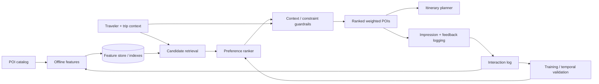

# Personalized POI Intelligence & Ranking System

A reproducible ML prototype for ranking travel Points of Interest (POIs) from traveler context, explicit preferences, historical behavior, and practical trip constraints.

The design deliberately separates **preference relevance** ("would this traveler want it?") from **context compatibility** ("does it make sense for this trip?").

## Architecture



## What is implemented

- deterministic synthetic POI/traveler/interaction data;
- leakage-safe historical features using only prior events;
- multi-lane candidate generation with long-tail preservation;
- temporal model selection;
- selected **regularized Logistic Regression** preference ranker;
- separate budget/mobility/family/availability compatibility scoring;
- final context-adjusted utility ranking;
- cold-start support;
- popularity baseline, ablations, failure analysis and scenario analysis.

## Why the simpler model won

The first 60% of each user's timeline is used for training, the next 15% for model selection, and the final 25% is untouched until selection is complete.

Validation results:

| Model | Precision@10 | Recall@10 | NDCG@10 |
|---|---:|---:|---:|
| **Logistic Regression, C=2** | **0.128** | **0.862** | **0.537** |
| Content/history scorer | 0.122 | 0.807 | 0.503 |
| HistGradientBoosting | 0.092 | 0.659 | 0.347 |
| LambdaMART-style LTR | 0.081 | 0.555 | 0.261 |

The dataset is small, sparse and dominated by explicit/content signals. The regularized linear model generalizes better than the more complex alternatives. This is intentionally an evidence-based model choice, not a complexity contest.

## Final untouched holdout

After model selection, Logistic Regression is refit on the first 75% and evaluated once on the final 25%.

| Preference metric | Result |
|---|---:|
| Precision@5 | **0.352** |
| Recall@5 | **0.700** |
| NDCG@5 | **0.628** |
| Precision@10 | **0.226** |
| Recall@10 | **0.910** |
| NDCG@10 | **0.709** |
| Candidate recall | **1.000** |
| Popularity baseline NDCG@10 | 0.070 |
| NDCG lift over popularity | **+0.639** |

The test set has only **2.48 relevant POIs per evaluated user on average**, so mean theoretical Precision@10 is capped at **0.248**. The achieved 0.226 is **91.1% of that ceiling**.

## Preference relevance vs final utility

The assignment asks the system to distinguish relevance from practical compatibility, so they are evaluated separately.

- preference ranking: NDCG@10 **0.709**, Recall@10 **0.910**;
- final context-adjusted utility: NDCG@10 **0.650**, Recall@10 **0.835**;
- constraint compatibility@10: **0.866**.

The contextual layer intentionally trades some pure behavioral relevance for feasibility.

## Final-test ablation

| Variant | Surface | NDCG@10 |
|---|---|---:|
| **Logistic Regression** | preference relevance | **0.709** |
| Content/history scorer | preference relevance | 0.656 |
| HistGradientBoosting | preference relevance | 0.480 |
| LambdaMART-style LTR | preference relevance | 0.392 |
| Popularity baseline | preference relevance | 0.070 |
| Logistic + context guardrails | final utility | 0.650 |

## Failure analysis

The weakest cases are explicitly documented in `reports/failure_analysis.csv`.

Observed issues include:

- held-out synthetic behavior that conflicts with explicit interests;
- sparse long-tail positives;
- rank-order errors where all relevant items are retrieved but the strongest one is not first.

Candidate recall is 1.0, so remaining error is primarily ranking/data ambiguity rather than retrieval loss.

## Three assignment scenarios

`reports/scenario_analysis.csv` contains ranked POIs and score decomposition for:

1. local food / neighborhoods / less-touristy travel;
2. history / architecture / museums;
3. family / parks / interactive / child-friendly travel.

## Repository structure

```text
.
├── data/
├── docs/
│   ├── technical_design.md
│   ├── production_architecture.md
│   └── evaluation_and_failures.md
├── experiments/
│   └── model_selection.py
├── reports/
│   ├── metrics.json
│   ├── model_selection_validation.csv
│   ├── ablation_results.csv
│   ├── failure_analysis.csv
│   ├── feature_coefficients.csv
│   ├── scenario_analysis.csv
│   └── baseline_comparison.md
├── src/poi_intelligence/
├── tests/test_pipeline.py
├── run.py
├── requirements.txt
└── requirements-experiments.txt
```

## Reproduce

Main pipeline:

```bash
python -m venv .venv
source .venv/bin/activate  # Windows: .venv\Scripts\activate
pip install -r requirements.txt
python run.py
pytest -q
```

Optional model-comparison experiment:

```bash
pip install -r requirements-experiments.txt
python experiments/model_selection.py
```

## Scope intentionally excluded

No RAG, chatbot, LLM travel assistant, itinerary/TSP optimization, booking/payment flow, frontend, or external orchestration. This repository implements only the POI intelligence/ranking layer requested in the assignment.