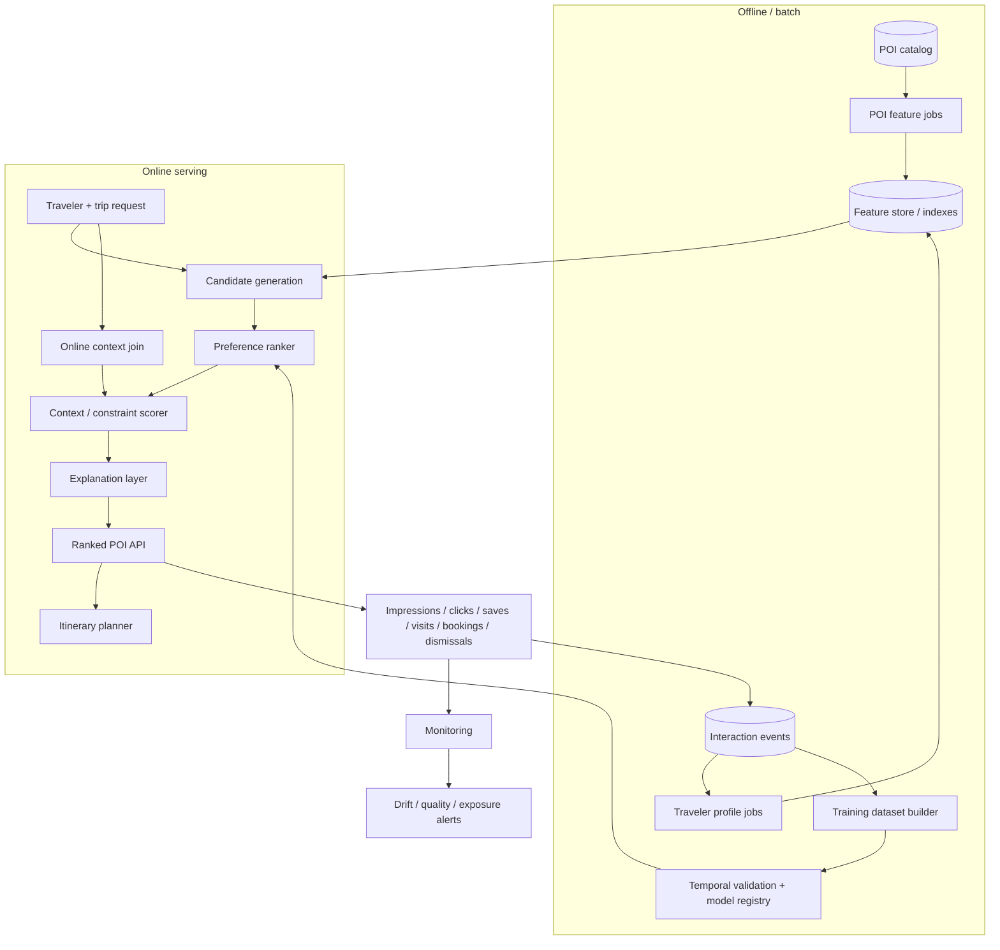

# Production Architecture

## Candidate retrieval at scale

The prototype scans a destination catalog because it contains only 168 POIs. At production scale, candidates would be unioned and deduplicated from several sources:

- destination/category indexes;
- ANN or two-tower semantic retrieval;
- collaborative candidates where sufficient behavior exists;
- a long-tail/local discovery lane;
- a quality/exploration lane for new POIs;
- hard eligibility filters for impossible destination/constraint combinations.

Candidate recall is monitored independently from ranker quality. In the synthetic holdout it is 1.0, so remaining error is primarily ranking/data ambiguity rather than retrieval loss.

## Offline and online features

**Offline:** smoothed ratings, review volume, popularity windows, content/category features, long-term traveler affinities, model parameters.

**Online:** active destination, dates, party, budget, mobility, session behavior, opening/availability state, distance and transient trip constraints.

Training and serving feature definitions should be versioned to prevent train/serve skew.

## Freshness and retraining

- live availability/opening state: event-driven or short TTL;
- session behavior: near real time;
- long-term traveler profiles: incremental or daily;
- popularity and quality aggregates: daily;
- model retraining: initially daily/weekly, later triggered by volume, drift and KPI change.

## Monitoring

Monitor:

- candidate recall and candidate-source mix;
- NDCG/Recall and online engagement proxies;
- constraint violation rate;
- feature missingness and drift;
- latency and error rate;
- catalog coverage and long-tail exposure;
- popularity concentration;
- slices by destination, party, budget and mobility;
- supplier/neighborhood exposure where relevant.

## Feedback-loop safeguards

Popularity and exposure can become self-reinforcing. Production logs therefore need impressions and rank position, not only positive interactions. New/local POIs should receive controlled exploration exposure, and real-world offline evaluation should eventually become impression-aware rather than treating every unobserved item as a negative.